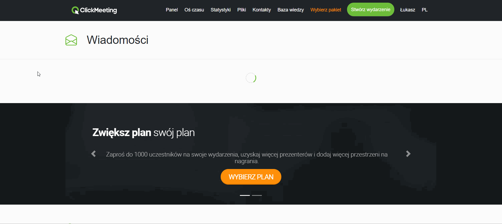

# clickmeeting-messages

## Opis projektu

#### Stronę z wiadomościami przygotowałem przy pomocy frameworka Vue.js. Sekcja z wiadomościami składa się z tabeli z filtrowaniem, sortowaniem oraz paginacją. Starałem się odwzorować style strony oraz komponentów aktualnego panela. Widok jest responsywny.

#### Główne wyzwanie polegało na tym, aby w odpowiedni sposób wyświetlić 1000 wiadomości, ponieważ operacje na drzewie DOM tak dużej ilości danych może powodować zawieszanie lub chwilowe przycinanie przeglądarki. Najczęściej aby rozwiązać ten problem stosuje się albo paginacje, albo infinite scroll. Warto dodać, że można do tego procesu podejść na dwa sposoby: od strony backendu gdzie pobierana jest niewielka część danych, a reszta jest odczytywana na kolejnych stronach paginacji/scrollu, oraz od strony frontendu gdzie dostajemy cały payload, który musimy odpowiednio wyrenderować na stronie. Domyślam się, że w zadaniu chodziło o ten drugi scenariusz, więc przygotowałem komponent z wygenerowanymi wiadomościami wraz z paginacją.

#### Do zarządzania stanem wykorzystałem globalny store i bibliotekę Vuex.

#### Aby uruchomić projekt potrzebne będzie środowisko node, npm oraz vue-cli. Poniżej załączam też gif z podglądem projektu.

## Project setup
```
npm install
```

### Compiles and hot-reloads for development
```
npm run dev
```

### Compiles and minifies for production
```
npm run build
```

### Lints and fixes files
```
npm run lint
```

